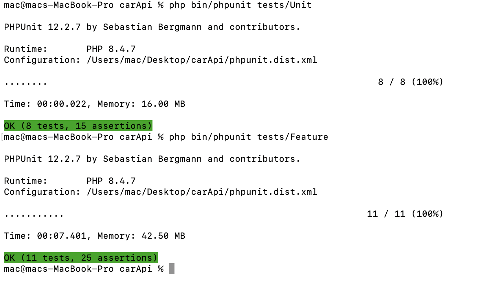

# simple-car-reservation


## Description

Ce projet Symfony implémente une API REST pour la gestion des réservations de voitures.
Les utilisateurs peuvent consulter les voitures disponibles, créer, modifier ou supprimer leurs propres réservations.

## Fonctionnalités implémentées

- [x] Authentification JWT (login via `/api/login_check`)
- [x] Liste et détails des voitures
- [x] Création, modification et suppression de réservations par utilisateur authentifié
- [x] Filtrage des réservations par utilisateur
- [x] Tests fonctionnels pour assurer le bon comportement des endpoints (création, mise à jour, suppression, accès restreint)
- [x] Gestion des autorisations pour restreindre l’accès aux réservations


## Technologies utilisées

- PHP 8.3
- Symfony 6
- PHPUnit
- Doctrine ORM
- JWT Auth (lexik/jwt-authentication-bundle)

## 🚀 Installation

1. **Clone the repository:**
   ```bash
   git clone <your-repo-url>
   cd carApi
   ```

2. **Install PHP dependencies:**
   ```bash
   composer install
   ```

3. **Configure your environment:**
   ```bash
    cp .env .env.local
    php bin/console lexik:jwt:generate-keypair
    ```

4. **Create the database and run migrations:**
   ```bash
   php bin/console doctrine:database:create
   php bin/console doctrine:migrations:migrate
   ```

5. **Load fixtures:**
   ```bash
   php bin/console doctrine:fixtures:load
   ```

6. **Start the Symfony server:**
   ```bash
   symfony server:start
   ```
   or
   ```bash
   php -S localhost:8000 -t public
   ```

### Lancer les tests

**Setup test database:**
```bash
php bin/console doctrine:database:drop --force --if-exists --env=test
php bin/console doctrine:database:create --env=test
php bin/console doctrine:migrations:migrate --no-interaction --env=test
php bin/console doctrine:fixtures:load --no-interaction --env=test
```

- **Run all tests:**
  ```bash
  php bin/phpunit
  ```

- **Run only feature (API) tests:**
  ```bash
  php bin/phpunit tests/Feature
  ```

- **Run only unit tests:**
  ```bash
  php bin/phpunit tests/Unit
  ```

- **API Testing with Postman:**

A Postman collection is provided in `doc/postman_collection.json`.

1. Import the collection into Postman.
2. Set the `base_url` variable (e.g., `http://localhost:8000`).
3. Run the `Login` request first to get a JWT token.
4. Use the other requests as needed. 
